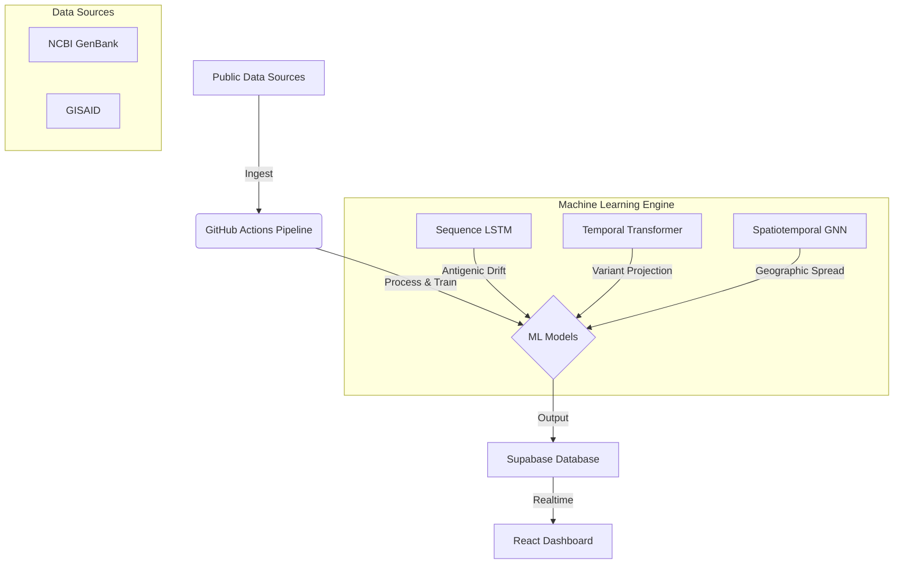

# FluSight-Asia: H3N2 Influenza Mutation Intelligence Platform


**FluSight-Asia** is an enterprise-grade machine learning platform for predicting H3N2 influenza virus mutations in Asia. It combines genomic surveillance with deep learning to forecast viral evolution, helping public health officials anticipate the next dominant strain.

---

## 🚀 Live Demo & Dashboard

*   **Frontend:** [Link to your Netlify deployment]
*   **API:** [Link to Supabase URL]

---

## 🧠 System Architecture

The platform operates on a **zero-cost infrastructure** using free tiers of modern cloud services.



## ✨ Key Features

### 1. 🔮 Predictive Modeling
*   **Antigenic Drift (LSTM):** Predicts the cumulative mutation changes in the HA1 protein segment.
*   **Variant Trajectory (Transformer):** Forecasts the probability distribution of competing clades over the next 12 weeks.
*   **Geographic Spread (GNN):** Simulation of how variants travel between key Asian hubs (Bangkok, Tokyo, Singapore, etc.).

### 2. 📊 Interactive Intelligence
*   **Real-time Dashboard:** Built with React 18 & Tailwind CSS.
*   **Sequence Explorer:** Search and filter thousands of H3N2 sequences by country, clade, and date.
*   **Automated Insights:** Natural language summaries of high-risk trends.

### 3. 🛡️ Enterprise Pipeline
*   **Automated Ingestion:** Daily GitHub Actions workflow fetches new sequences from NCBI.
*   **Quality Control:** Automated filtering of incomplete or low-quality sequences.
*   **Versioned Data:** Full audit trail of data snapshots in PostgreSQL (Supabase).

---

## 🛠️ Technology Stack

| Component | Technology | Description |
|-----------|------------|-------------|
| **Frontend** | React 18, Vite, TypeScript | Fast, responsive dashboard UI |
| **Styling** | Tailwind CSS | Modern, utility-first styling |
| **Database** | Supabase (PostgreSQL) | Relational data + Vector storage |
| **ML Engine** | PyTorch, PyTorch Geometric | Deep learning framework |
| **Pipeline** | GitHub Actions, Python 3.11 | Automated ET(L) & Inference |
| **Bioinformatics** | BioPython, MAFFT | Sequence alignment & parsing |

---

## 🏁 Getting Started

### Prerequisites
*   Node.js 18+
*   Python 3.11+
*   Supabase Account

### 1. Clone the Repository
```bash
git clone https://github.com/rofiperlungoding/flusight-asia.git
cd flusight-asia
```

### 2. Backend Setup (Pipeline)
```bash
cd pipeline
python -m venv .venv
source .venv/bin/activate  # or .venv\Scripts\activate on Windows
pip install -e ".[dev]"

# Create a .env file based on .env.example
# Run the pipeline locally
python scripts/ingest.py
```

### 3. Frontend Setup
```bash
cd frontend
npm install
npm run dev
```

---

## 🧪 Running Tests

The project includes a comprehensive test suite for the ML pipeline.

```bash
cd pipeline
pytest tests/
```

---

## 📜 License

This project is open-source under the [MIT License](LICENSE).

---

*Built with ❤️ for the global health community.*
